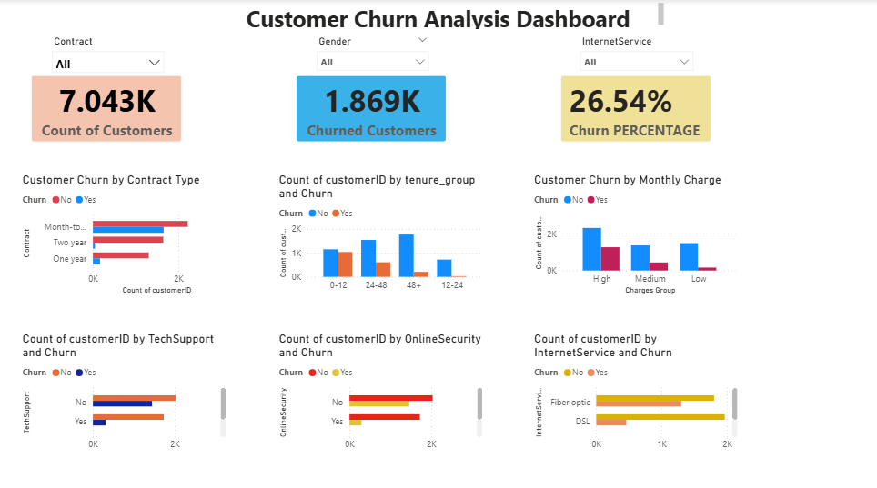

# Customer Churn Analysis Dashboard 

##  About Project

This project is a simple Customer Churn Analysis Dashboard created using Power BI.
The main goal is to understand why customers are leaving and find useful patterns from the data.

##  Dashboard Preview

##  What I Did

* Cleaned and prepared the dataset
* Created KPIs like Total Customers, Churned Customers, and Churn Rate
* Used charts to analyze customer behavior
* Added filters (slicers) to explore data easily

##  Dashboard Insights

* Around some percentage of customers are leaving (churn rate)
* Month-to-month contract customers churn more
* New customers (low tenure) leave more
* Customers with high monthly charges churn more
* Lack of Tech Support and Online Security increases churn

##  Tools Used

* Power BI
* DAX (for calculated columns like Tenure Group)

## Files Included

* Customer_Churn_Dashboard.pbix
* customer_churn.csv
* dashboard.png

##  Key Features

* KPI Cards for quick overview
* Churn by Contract (main chart)
* Churn by Tenure and Monthly Charges
* Service-based analysis (Tech Support, Online Security, Internet Service)
* Slicers for filtering (Contract, Gender, Internet Service)

##  What I Learned

* How to build a clean and simple dashboard
* How to use DAX for grouping data
* How to present insights clearly

##  Conclusion

This dashboard helps to understand customer churn and gives simple insights which can help a business improve customer retention.

---
